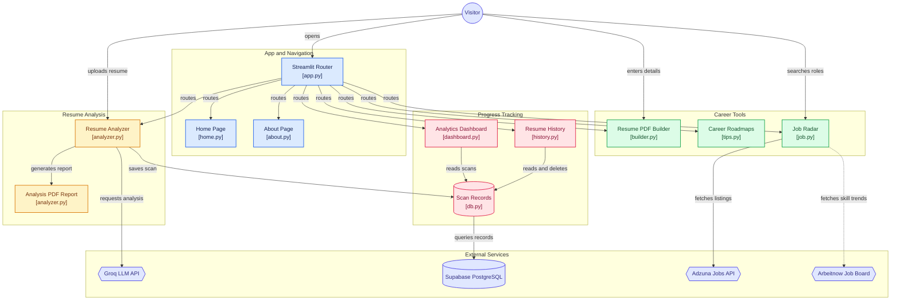

# ResuTrack — ATS Resume Analyzer

An AI-powered resume analysis tool that gives you an ATS (Applicant Tracking System) compatibility score, actionable feedback, and tracks your improvement over time.

**Live App:** [resutrack-ai.streamlit.app](https://resutrack-ai.streamlit.app)

---

## About

ResuTrack was built to solve a real problem — generic resume advice online never tells you what's *actually* missing for the specific role you're targeting. It combines AI-powered ATS analysis, progress tracking, and career guidance into one tool, so the entire job-hunt loop (analyze → improve → learn → apply) lives in one place.

Every scan is saved, so you can track how your ATS score improves scan over scan as you apply the feedback, compare any two versions of your resume side by side, and revisit past results anytime. Beyond the resume itself, it also helps with the next steps — a career roadmap for skills you're missing, and a live job search.

---

## Features

### 🔍 Resume Analyzer
- Upload a PDF resume and get an instant **ATS match score** (out of 100) for your target role
- Score breakdown across **Skills, Formatting, Keywords, and Impact**
- **Detected vs. Missing skills** shown as clear visual badges
- **ATS Compliance Audit** — pass/fail checklist for formatting issues
- **AI-generated feedback** with a strategic assessment of the resume
- **Bullet point optimization** — AI rewrites one weak bullet into a stronger, impact-driven version
- **AI Interview Question Generator** — generates tailored technical + behavioral questions based on your resume and target role
- **AI Answer Feedback** — type your answer to a generated interview question and get direct AI feedback on what's strong, what's missing, and how to improve it
- **Downloadable PDF report** of the full analysis

### 📊 Analytics Dashboard
- Visual **progress tracking** across all your past scans (score trend over time)
- **Scan comparison** — pick any two scans and see what improved, what's still missing, and new gaps
- Key stats: current score, improvement %, most targeted role, total scans logged

### 🕘 Resume History
- Every scan is saved and can be revisited anytime
- Expandable details per scan (detected/missing skills, feedback)
- Delete old scans you no longer need

### 📄 Resume Generator
- Build a resume from scratch within the app, with a live preview synced to an actual PDF generator

### 🧭 Career Roadmap
- Role-specific upskilling guidance — 45+ role-specific roadmaps researched and structured by hand, not AI-generated

### 📡 Job Radar
- Search **live job listings** relevant to your target role, powered by the Adzuna Jobs API

### ℹ️ About
- In-app page with the project's backstory, feature list, and tech stack

---

## Tech Stack

| Layer | Technology |
|---|---|
| Frontend / App Framework | [Streamlit](https://streamlit.io) |
| AI / LLM | [Groq API](https://groq.com) (`openai/gpt-oss-120b`, Llama-3.3) |
| Job Listings | [Adzuna Jobs API](https://developer.adzuna.com) |
| Database | [Supabase](https://supabase.com) (PostgreSQL) |
| PDF Parsing | PyPDF2 |
| PDF Report Generation | ReportLab |
| Charts | Plotly |
| Navigation | streamlit-option-menu |

---

## How It Works

- Each visitor gets a unique session ID (stored in the URL as `?sid=...`), which keeps their scan history private and separate from every other user's — without requiring a login.
- All scan data (ATS scores, detected/missing skills, feedback, timestamps) is stored in **Supabase**, so history and dashboard analytics persist reliably across app restarts and redeploys — unlike a local SQLite file, which is wiped whenever the hosting container restarts.
- **Bookmark your session URL** to return to your own scan history later.

---

## Architecture



---

## Local Setup

1. Clone the repo and install dependencies:
   ```bash
   pip install -r requirements.txt
   ```

2. Create a `.streamlit/secrets.toml` file in the project root with:
   ```toml
   GROQ_API_KEY = "your_groq_api_key"
   SUPABASE_URL = "your_supabase_project_url"
   SUPABASE_KEY = "your_supabase_anon_key"
   ADZUNA_APP_ID = "your_adzuna_app_id"
   ADZUNA_APP_KEY = "your_adzuna_app_key"
   ```

3. Run the app:
   ```bash
   streamlit run app.py
   ```

---

## Project Structure

```
resume-project/
├── app.py            # Main entry point, navigation, and routing
├── analyzer.py        # Resume Analyzer — ATS scoring, AI feedback, interview prep + answer feedback
├── dashboard.py        # Analytics Dashboard — progress charts, scan comparison
├── history.py         # Resume Scan History
├── builder.py          # Resume Generator
├── tips.py            # Career Roadmap
├── job.py             # Job Radar
├── home.py            # Home page
├── about.py            # About page
├── db.py              # Supabase database layer (add/get/delete scans)
└── .streamlit/
    └── secrets.toml    # API keys and credentials (not committed)
```

---

## Roadmap

- [ ] User accounts (email/password login) for cross-device history access
- [ ] Cover Letter Generator — AI-generated cover letters matched to your resume and target role
- [ ] Export Interview Prep as flashcards for offline study
---

Built by Kanishka.